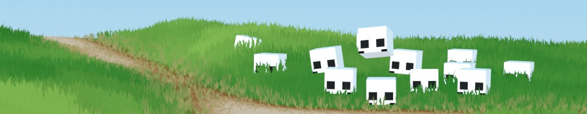
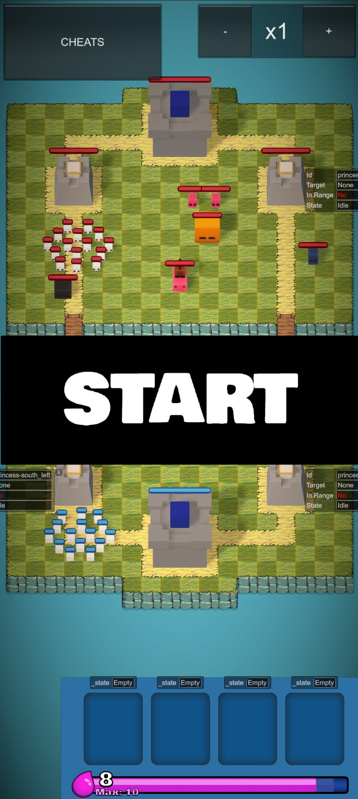
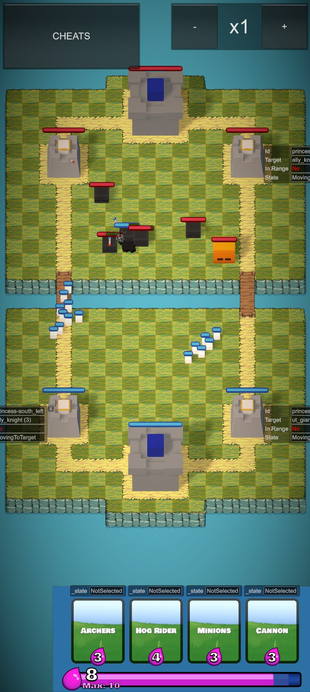
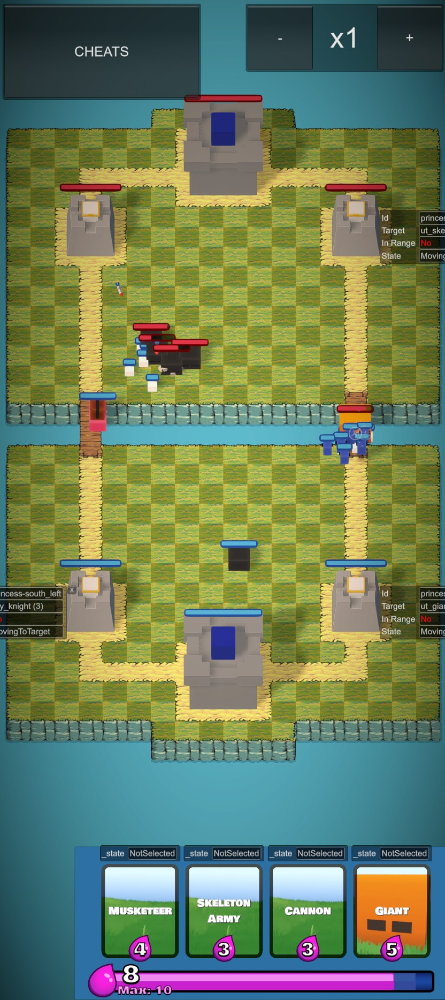
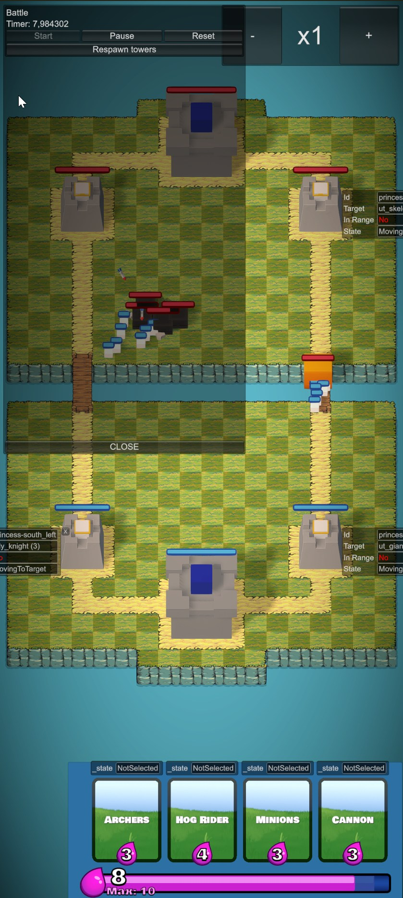

<div align="center">
  
</div>

## 🚧 Under construction 🚧

# Forest Royale

## 🎮 Game Overview

Forest Royale combines the tactical card-based gameplay of Clash Royale with an adventurous PvE experience. Players roam through a dynamic forest environment, encountering different challenges and enemies as they explore. Each encounter is unique, offering fresh strategic opportunities and obstacles.


<div align="center">
  
  
  
  
</div>

## 📝 License

This project is licensed under a custom license - see the [LICENSE](LICENSE) file for details.

## Libraries
- VContainer
- Odin Inspector
- DOTween

## Installation
1. Clone the repository
   ```bash
   git clone git@github.com:AimarGonzalez/ForestRoyale.git
   ```
2. Open the main scene `Assets/Game/Scenes/TrainingArea.unity`

## 📞 Contact

- **LinkedIn**: [Aimar Gonzalez](https://www.linkedin.com/in/aimargonzalez/)
- **Discord**: 'aimargonzalez' or 'Aimar#9678'

